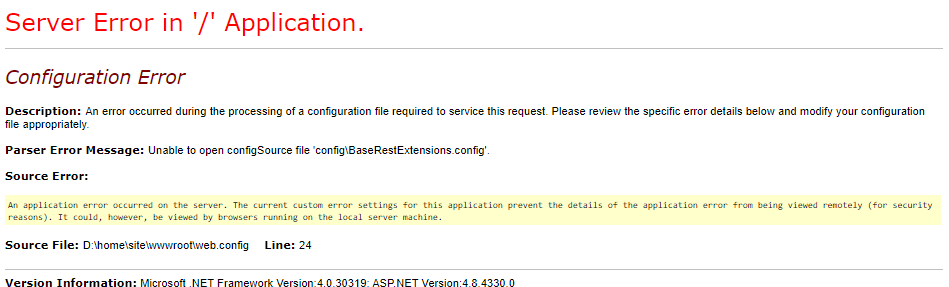
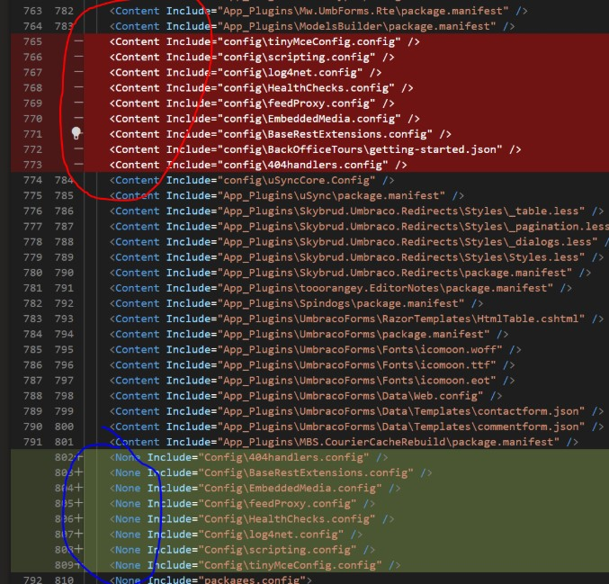

# Unable to open ConfigSource file

This is due to the Build Action being changed on the file -&#x20;

To fix, just check all the files that have had the Build Action changed and change back to Content.

